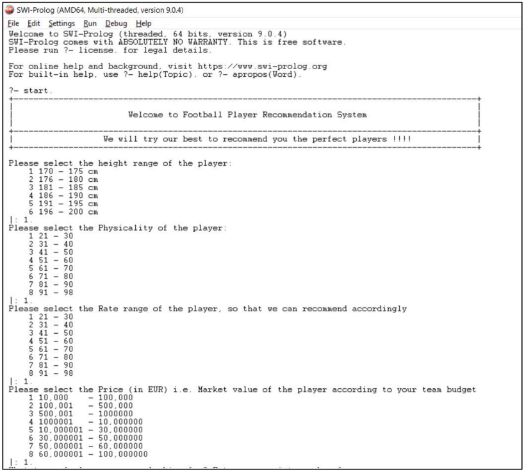
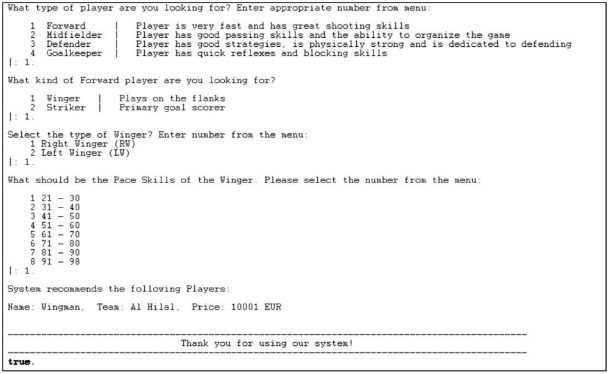

**Report** 

|This is a Football Player Recommendation System using Prolog. This project comes under |
| - |
|Artificial Intelligence domain. |
||
|This is a Rule based Recommendation system consists of many facts which recommends the |
|best players according to the attributes input by the user. It asks for multiple questions, based |
|on that the system recommends the best players. |
||
|The image below shows the flow chart for the system: |
||
||
||
||
**Running** 

- Download and Install SWI-Prolog from[ https://www.swi-prolog.org/Download.html.](https://www.swi-prolog.org/Download.html) 
- Click on File > Edit and then choose the .pl file.  
- Click on Compile > Compile Buffer. 
- Now, type start. In the console and program would start executing. 
- Further answer the questions for best players recommendations. 

**Working** 

- It asks for the height range of the player. Enter number from the menu accordingly. 
- It asks for the physicality of the player. Enter number from the menu accordingly. 
- It asks for the Rate range of the player. Enter number from the menu accordingly. 
- It asks for the Price in Euro of the player. Enter number from the menu accordingly. 
- Then it asks for the type of the player. There are following type: 
- Forward - Player is very fast and has great shooting skills 
- Midfielder - Player has good passing skills and the ability to organize the game 
- Defender - Player has good strategies, is physically strong and is dedicated to defending 
- Goalkeeper - Player has quick reflexes and blocking skills 
- Based on the Player type it asks further questions. Choose appropriately. 

**Screenshots** 

**Appendix – Code** 

- player('Name', 'Age', 'Nationality', 'Position', 'SubPosition', 
- 'Height', 'Physicality', 'Rate', 'Price', 'Team', 'Shooting', 'Quick 
- Footworks','No of Goals', 'Defending', 'Passing', 'Dribbling', 'Pace', 
- 'Foot'). 

player('Ali', 21, 'Morocco', 'Defender', 'Right Back', 171, 22, 22, 10000, 'Al Hilal', 21, 'yes', 21, 21, 21, 21, 21, 'Right'). 

player('Yassine Bounou', 32, 'Morocco', 'Goalkeeper', 'None', 172, 22, 25, 10001, 'Al Hilal', 21, 'yes', 21, 21, 21, 21, 21, 'Right'). 

player('Midman', 32, 'Morocco', 'Midfielder', 'Defensive Midfielder', 172, 22, 25, 10001, 'Al Hilal', 21, 'yes', 21, 21, 21, 21, 21, 'Right'). 

player('Wingman', 32, 'Morocco', 'Winger', 'Right Winger', 172, 22, 25, 10001, 'Al Hilal', 21, 'yes', 21, 21, 21, 21, 21, 'Right'). 

player('Strikerman', 32, 'Saudhi Arabia', 'Striker', 'None', 172, 22, 25, 10001, 'Al Hilal', 21, 'yes', 5, 21, 21, 21, 21, 'Right'). 

start:- 

`    `writeln("+--------------------------------------------------------------------------------------------- +"), 

writeln("|                                                                                             |"), 

`    `writeln("|                       Welcome to Football Player Recommendation System                      |"), 

writeln("|                                                                                             |"), 

`    `writeln("+--------------------------------------------------------------------------------------------- +"), 

`    `writeln("|                  We will try our best to recommend you the perfect players !!!!             |"), 

`    `writeln("+--------------------------------------------------------------------------------------------- +"), nl, 

main. 

main:- 

`    `writeln("Please select the height range of the player:"),     writeln("    1 170 - 175 cm"), 

`    `writeln("    2 176 - 180 cm"), 

`    `writeln("    3 181 - 185 cm"), 

`    `writeln("    4 186 - 190 cm"), 

`    `writeln("    5 191 - 195 cm"), 

`    `writeln("    6 196 - 200 cm"), 

read(PlayerHeight), 

`    `(   (PlayerHeight < 1; PlayerHeight > 6) -> writeln("Invalid Input! You must write number between 1 and 6"), main; write("")), 

`    `(   PlayerHeight == 1 -> physicality([170, 171, 172, 173, 174, 175]); PlayerHeight == 2 -> physicality([176, 177, 178, 179, 180]); PlayerHeight == 3 -> physicality([181, 182, 183, 184, 185]); PlayerHeight == 4 -> physicality([186, 187, 188, 189, 190]); PlayerHeight == 5 -> physicality([191, 192, 193, 194, 195]); PlayerHeight == 6 -> physicality([196, 197, 198, 199, 200])). 

physicality(PlayerHeight):- 

`    `writeln("Please select the Physicality of the player:"),     writeln("    1 21 - 30"), 

`    `writeln("    2 31 - 40"), 

`    `writeln("    3 41 - 50"), 

`    `writeln("    4 51 - 60"), 

`    `writeln("    5 61 - 70"), 

`    `writeln("    6 71 - 80"), 

`    `writeln("    7 81 - 90"), 

`    `writeln("    8 91 - 98"), 

read(PlayerPhysicality), 

`    `(   (PlayerPhysicality < 1; PlayerPhysicality > 8) -> writeln("Invalid Input! You must write number between 1 and 8"), physicality(PlayerHeight); write("")), 

`    `(   PlayerPhysicality == 1 -> rating(PlayerHeight, [21, 22, 23, 24, 25, 26, 27, 28, 29, 30]); PlayerPhysicality == 2 -> rating(PlayerHeight, [31, 32, 33, 34, 35, 36, 37, 38, 39, 40]); PlayerPhysicality == 3 -> rating(PlayerHeight, [41, 42, 43, 44, 45, 46, 47, 48, 49, 50]); PlayerPhysicality == 4 -> rating(PlayerHeight, [51, 52, 53, 54, 55, 56, 57, 58, 59, 60]); PlayerPhysicality == 5 -> rating(PlayerHeight,[61, 62, 63, 64, 65, 66, 67, 68, 69, 70]); PlayerPhysicality == 6 -> rating(PlayerHeight, [71, 72, 73, 74, 75, 76, 77, 78, 79, 80]); PlayerPhysicality == 7 -> rating(PlayerHeight, [81, 82, 83, 84, 85, 86, 87, 88, 89, 90]); PlayerPhysicality == 8 -> rating(PlayerHeight, [91, 92, 93, 94, 95, 96, 97, 98])). 

rating(PlayerHeight, PlayerPhysicality):- 

`    `writeln("Please select the Rate range of the player, so that we can recommend accordingly"), 

writeln("    1 21 - 30"), writeln("    2 31 - 40"), writeln("    3 41 - 50"), writeln("    4 51 - 60"), writeln("    5 61 - 70"), writeln("    6 71 - 80"), 

writeln("    7 81 - 90"), writeln("    8 91 - 98"), 

read(PlayerRate), 

`    `(   (PlayerRate < 1; PlayerRate > 4) -> writeln("Invalid Input! You must write number between 1 and 8"), rating(PlayerHeight, PlayerPhysicality); write("")), 

`    `(   PlayerRate == 1 -> price(PlayerHeight, PlayerPhysicality, [21, 30]); PlayerRate == 2 -> price(PlayerHeight, PlayerPhysicality, [31, 40]); PlayerRate == 3 -> price(PlayerHeight, PlayerPhysicality, [41, 50]); PlayerRate == 4 -> price(PlayerHeight, PlayerPhysicality, [51, 60]); PlayerRate == 5 -> price(PlayerHeight, PlayerPhysicality, [61, 70]); PlayerRate == 6 -> price(PlayerHeight, PlayerPhysicality, [71, 80]);  PlayerRate == 7 -> price(PlayerHeight, PlayerPhysicality, [81, 90]);  PlayerRate == 8 -> price(PlayerHeight, PlayerPhysicality, [91, 98])). 

price(PlayerHeight, PlayerPhysicality, PlayerRate):- 

`    `writeln("Please select the Price (in EUR) i.e. Market value of the player according to your team budget"), 

writeln("    1 10,000    - 100,000"), writeln("    2 100,001   - 500,000"), writeln("    3 500,001   - 1000000"), writeln("    4 1000001   - 10,000000"), writeln("    5 10,000001 - 30,000000"), writeln("    6 30,000001 - 50,000000"), writeln("    7 50,000001 - 60,000000"), writeln("    8 60,000001 - 100,000000"), 

read(PlayerPrice), 

`    `(   (PlayerPrice < 1; PlayerPrice > 8) -> writeln("Invalid Input! You must write number between 1 and 8"), price(PlayerHeight, PlayerPhysicality, PlayerRate); write("")), 

`    `(   PlayerPrice == 1 -> position(PlayerHeight, PlayerPhysicality, PlayerRate, [10000 , 100000]); PlayerPrice == 2 -> position(PlayerHeight, PlayerPhysicality, PlayerRate, [100001, 500000]); PlayerPrice == 3 -> position(PlayerHeight, PlayerPhysicality, PlayerRate, [500001, 1000000]); PlayerPrice == 4 -> position(PlayerHeight, PlayerPhysicality, PlayerRate, [1000001, 10000000]); PlayerPrice == 5 -> position(PlayerHeight, PlayerPhysicality, PlayerRate, [10000001, 30000000]); PlayerPrice == 6 -> position(PlayerHeight, PlayerPhysicality, PlayerRate, [30000001, 50000000]);  PlayerPrice == 7 -> position(PlayerHeight, PlayerPhysicality, PlayerRate, [50000001, 60000000]);  PlayerPrice == 8 -> position(PlayerHeight, PlayerPhysicality, PlayerRate, [60000001, 100000000])). 

position(PlayerHeight, PlayerPhysicality, PlayerRate, PlayerPrice):- 

`    `writeln("What type of player are you looking for? Enter appropriate number from menu:"),nl, 

writeln("    1  Forward     |   Player is very fast and has great shooting skills"), 

`    `writeln("    2  Midfielder  |   Player has good passing skills and the ability to organize the game"), 

`    `writeln("    3  Defender    |   Player has good strategies, is physically strong and is dedicated to defending"), 

writeln("    4  Goalkeeper  |   Player has quick reflexes and blocking skills"), read(PlayerType), 

`    `(   (PlayerType < 1; PlayerType > 4) -> writeln("Invalid Input! You must write number between 1 and 4"), position(PlayerHeight, PlayerPhysicality, PlayerRate, PlayerPrice); writeln("")), 

`    `(   PlayerType == 1 -> forward(PlayerHeight, PlayerPhysicality, PlayerRate, PlayerPrice); PlayerType == 2 -> midfielder(PlayerHeight, PlayerPhysicality, PlayerRate, PlayerPrice); PlayerType == 3 -> defender(PlayerHeight, PlayerPhysicality, PlayerRate, PlayerPrice); PlayerType == 4 -> goalkeeper(PlayerHeight, PlayerPhysicality, PlayerRate, PlayerPrice)). 

forward(PlayerHeight, PlayerPhysicality, PlayerRate, PlayerPrice):-     writeln("What kind of Forward player are you looking for?"),nl, 

writeln("    1  Winger   |   Plays on the flanks"), writeln("    2  Striker  |   Primary goal scorer"), 

read(ForwardType), 

`    `(   (ForwardType < 1; ForwardType > 2) -> writeln("Invalid Input! You must write either 1 or 2"), forward(PlayerHeight, PlayerPhysicality, PlayerRate, PlayerPrice); writeln("")), 

`     `(   ForwardType == 1 -> winger(PlayerHeight, PlayerPhysicality, PlayerRate, PlayerPrice); ForwardType == 2 -> striker(PlayerHeight, PlayerPhysicality, PlayerRate, PlayerPrice)). 

striker(PlayerHeight, PlayerPhysicality, PlayerRate, PlayerPrice):-     Position = 'Striker', 

`    `writeln("How many goals must be scored by the player. Please select the number from the menu:"),nl, 

writeln("    1  1 to 10"), writeln("    2  11 to 20"), writeln("    3  21 to 30"), writeln("    4  31 to 40"), writeln("    5  41 to 50"), writeln("    6  51 to 60"), writeln("    7  61 to 70"), writeln("    8  71 to 80"), writeln("    9  81 to 90"), writeln("    10 91 to 100"), 

read(PlayerGoals), 

`    `( (PlayerGoals < 1; PlayerGoals > 10) -> writeln("Invalid Input! You must write number between 1 and 10"), striker(PlayerHeight, PlayerPhysicality, PlayerRate, PlayerPrice); writeln("")), 

`     `( PlayerGoals == 1 -> Goals = [1, 10]; PlayerGoals == 2 -> Goals = [11, 20]; PlayerGoals == 3 -> Goals = [21, 30]; PlayerGoals == 4 -> Goals = [31, 40]; PlayerGoals == 5 -> Goals = [41, 50]; PlayerGoals == 6 -> Goals = [51, 60]; PlayerGoals == 7 -> Goals = [61, 70]; PlayerGoals == 8 -> Goals = [71, 80]; PlayerGoals == 9 -> Goals = [81, 90]; PlayerGoals == 10 -> Goals = [91, 100]), 

`    `writeln("What should be the Shooting Skills of the player. Please select the number from the menu:"),nl, 

writeln("    1 21 - 30"), writeln("    2 31 - 40"), writeln("    3 41 - 50"), writeln("    4 51 - 60"), writeln("    5 61 - 70"), writeln("    6 71 - 80"), writeln("    7 81 - 90"), 

writeln("    8 91 - 98"), read(PlayerShooting), 

`    `(   (PlayerShooting < 1; PlayerShooting > 8) -> writeln("Invalid Input! You must write number between 1 and 8"), goalkeeper(PlayerHeight, PlayerPhysicality, PlayerRate, PlayerPrice); writeln("")), 

`     `(   PlayerShooting == 1 -> Shooting = [21, 30]; PlayerShooting == 2 -> Shooting = [31, 40]; PlayerShooting == 3 -> Shooting = [41, 50]; PlayerShooting == 4 -> Shooting = [51, 60]; PlayerShooting == 5 -> Shooting = [61, 70]; PlayerShooting == 6 -> Shooting = [71, 80]; PlayerShooting == 7 -> Shooting = [81, 90]; PlayerShooting == 8 -> Shooting = [91, 98]), 

writeln("Will you prefer a player with Best Right foot? (yes/no)"), read(PlayerFoot), 

`    `(   not(PlayerFoot == 'yes'), not(PlayerFoot == 'no') -> writeln("Invalid Input! You must write either yes or no."), striker(PlayerHeight, PlayerPhysicality, PlayerRate, PlayerPrice); 

(   (PlayerFoot == 'yes') -> Foot = 'Right'; Foot = 'Left')), 

`    `find\_results\_for\_striker(\_, \_, Position, \_, PlayerHeight, PlayerPhysicality, PlayerRate, PlayerPrice, \_, Shooting, \_, Goals, \_, \_, \_, \_, Foot, Results), 

`    `(Results = [] -> write("Sorry, based on the given criteria no suitable player found! Please change your criteria"); writeln("System recommends the following Players:"),nl, print\_list(Results)), end. 

find\_results\_for\_striker(\_, \_, Position, \_, PlayerHeight, PlayerPhysicality, PlayerRate, PlayerPrice, \_, Shooting, \_, Goals, \_, \_, \_, \_, Foot, Results) :- 

`    `findall((Name, Team, Price), ( 

`        `member(Height, PlayerHeight), 

`        `member(Physicality, PlayerPhysicality), 

`        `player(Name, \_, \_, Position, \_, Height, Physicality, Rate, Price, Team, Shoot, \_, Goal, \_, \_, \_, \_, Foot), 

`        `nonvar(Name), 

`        `within\_range(Shoot, Shooting),         within\_range(Goal, Goals), 

`        `within\_range(Rate, PlayerRate),         within\_range(Price, PlayerPrice)     ), Results). 

midfielder(PlayerHeight, PlayerPhysicality, PlayerRate, PlayerPrice):-     Position = 'Midfielder', 

writeln("Select the type of Midfielder? Enter number from the menu:"), writeln("    1 Defensive Midfielder (CDM) - Protects the defense."), writeln("    2 Central Midfielder (CM) - Plays in the middle"), writeln("    3 Attacking Midfielder (CAM) - Supports the attack"), 

read(PlayerSubPosition), 

`    `(   (PlayerSubPosition < 1; PlayerSubPosition > 3) -> writeln("Invalid Input! You must write number between 1 and 3"), midfielder(PlayerHeight, PlayerPhysicality, PlayerRate, PlayerPrice); writeln("")), 

`     `(   (PlayerSubPosition == 1) -> SubPosition = 'Defensive Midfielder'; PlayerSubPosition == 2 -> SubPosition = 'Central Midfielder'; PlayerSubPosition == 3 -> SubPosition = 'Attacking Midfielder'), 

`    `writeln("What should be the Passing Skills of the Midfielder. Please select the number from the menu:"),nl, 

writeln("    1 21 - 30"), writeln("    2 31 - 40"), writeln("    3 41 - 50"), writeln("    4 51 - 60"), writeln("    5 61 - 70"), writeln("    6 71 - 80"), writeln("    7 81 - 90"), writeln("    8 91 - 98"), 

read(PlayerPassing), 

`    `(   (PlayerPassing < 1; PlayerPassing > 8) -> writeln("Invalid Input! You must write number between 1 and 8"), midfielder(PlayerHeight, PlayerPhysicality, PlayerRate, PlayerPrice); writeln("")), 

`     `(   PlayerPassing == 1 -> Passing = [21, 30]; PlayerPassing == 2 ->  Passing = [31, 40]; PlayerPassing == 3 ->  Passing = [41, 50]; PlayerPassing == 4 ->  Passing = [51, 60]; PlayerPassing == 5 ->  Passing = [61, 70]; PlayerPassing == 6 ->  Passing = [71, 80]; PlayerPassing == 7 ->  Passing = [81, 90]; PlayerPassing == 8 ->  Passing = [91, 98]), 

`    `writeln("What should be the Dribbling Skills of the Midfielder. Please select the number from the menu:"),nl, 

writeln("    1 21 - 30"), 

writeln("    6 71 - 80"), writeln("    7 81 - 90"), writeln("    8 91 - 98"), 

read(PlayerDribbling), 

`    `(   (PlayerDribbling < 1; PlayerDribbling > 8) -> writeln("Invalid Input! You must write number between 1 and 8"), midfielder(PlayerHeight, PlayerPhysicality, PlayerRate, PlayerPrice); writeln("")), 

`     `(   PlayerDribbling == 1 -> Dribbling = [21, 30]; PlayerDribbling == 2 ->  Dribbling = [31, 40]; PlayerDribbling == 3 ->  Dribbling = [41, 50]; PlayerDribbling == 4 ->  Dribbling = [51, 60]; PlayerDribbling == 5 ->  Dribbling = [61, 70]; PlayerDribbling == 6 ->  Dribbling = [71, 80]; PlayerDribbling == 7 ->  Dribbling = [81, 90]; PlayerDribbling == 8 ->  Dribbling = [91, 98]), 

`    `find\_results\_for\_midfielder(\_, \_, Position, SubPosition, PlayerHeight, PlayerPhysicality, PlayerRate, PlayerPrice, \_, \_, \_, \_, \_, Passing, Dribbling, \_, \_, Results), 

`    `(Results = [] -> write("Sorry, based on the given criteria no suitable player found! Please change your criteria"); writeln("System recommends the following Players:"),nl, print\_list(Results)), end. 

find\_results\_for\_midfielder(\_, \_, Position, SubPosition, PlayerHeight, PlayerPhysicality, PlayerRate, PlayerPrice, \_, \_, \_, \_, \_, Passing, Dribbling, \_, \_, Results) :- 

`    `findall((Name, Team, Price), ( 

`        `member(Height, PlayerHeight), 

`        `member(Physicality, PlayerPhysicality), 

`        `player(Name, \_, \_, Position, SubPosition, Height, Physicality, Rate, Price, Team, \_, \_, \_, \_, Pass, Dribble, \_, \_), 

`        `nonvar(Name), 

`        `within\_range(Dribble, Dribbling),         within\_range(Rate, PlayerRate), 

`        `within\_range(Price, PlayerPrice),         within\_range(Pass, Passing) 

`    `), Results). 

winger(PlayerHeight, PlayerPhysicality, PlayerRate, PlayerPrice):-     Position = 'Winger', 

writeln("Select the type of Winger? Enter number from the menu:"), writeln("    1 Right Winger (RW)"), 

writeln("    2 Left Winger (LW)"), 

read(PlayerSubPosition), 

`    `(   (PlayerSubPosition < 1; PlayerSubPosition > 2) -> writeln("Invalid Input! You must write number between 1 and 2"), winger(PlayerHeight, PlayerPhysicality, PlayerRate, PlayerPrice); writeln("")), 

`     `(   (PlayerSubPosition == 1) -> SubPosition = 'Right Winger'; PlayerSubPosition == 2 -> SubPosition = 'Left Winger'), 

`    `writeln("What should be the Pace Skills of the Winger. Please select the number from the menu:"),nl, 

writeln("    1 21 - 30"), writeln("    2 31 - 40"), 

writeln("    3 41 - 50"), 

writeln("    8 91 - 98"), 

read(PlayerPace), 

`    `(   (PlayerPace < 1; PlayerPace > 8) -> writeln("Invalid Input! You must write number between 1 and 8"), winger(PlayerHeight, PlayerPhysicality, PlayerRate, PlayerPrice); writeln("")), 

`     `(   PlayerPace == 1 -> Pace = [21, 30]; PlayerPace == 2 ->  Pace = [31, 40]; PlayerPace == 3 ->  Pace = [41, 50]; PlayerPace == 4 ->  Pace = [51, 60]; PlayerPace == 5 ->  Pace = [61, 70]; PlayerPace == 6 ->  Pace = [71, 80]; PlayerPace == 7 ->  Pace = [81, 90]; PlayerPace == 8 ->  Pace = [91, 98]), 

`     `find\_results\_for\_winger(\_, \_, Position, SubPosition, PlayerHeight, PlayerPhysicality, PlayerRate, PlayerPrice, \_, \_, \_, \_, \_, \_, \_, Pace, \_, Results), 

`    `(Results = [] -> write("Sorry, based on the given criteria no suitable player found! Please change your criteria"); writeln("System recommends the following Players:"),nl, print\_list(Results)), end. 

find\_results\_for\_winger(\_, \_, Position, SubPosition, PlayerHeight, PlayerPhysicality, PlayerRate, PlayerPrice, \_, \_, \_, \_, \_, \_, \_, Pace, \_, Results) :- 

`    `findall((Name, Team, Price),( 

`        `member(Height, PlayerHeight), 

`        `member(Physicality, PlayerPhysicality), 

`        `player(Name, \_, \_, Position, SubPosition, Height, Physicality, Rate, Price, Team, \_, \_, \_, \_, \_, \_, Pc, \_), 

nonvar(Name), within\_range(Rate, PlayerRate), within\_range(Price, PlayerPrice), within\_range(Pc, Pace) 

), Results). 

defender(PlayerHeight, PlayerPhysicality, PlayerRate, PlayerPrice):-     Position = 'Defender', 

writeln("Select the type of Defender? Enter number from the menu:"), writeln("    1 Right Back (RB) - Defends on the right side"), 

writeln("    2 Center Back (CB) - Guards the central area"), 

writeln("    3 Left Back (LB) - Defends on the left side"), 

read(PlayerSubPosition), 

`    `(   (PlayerSubPosition < 1; PlayerSubPosition > 3) -> writeln("Invalid Input! You must write number between 1 and 3"), defender(PlayerHeight, PlayerPhysicality, PlayerRate, PlayerPrice); writeln("")), 

`     `(   (PlayerSubPosition == 1) -> SubPosition = 'Right Back'; PlayerSubPosition == 2 -> SubPosition = 'Center Back'; PlayerSubPosition == 3 -> SubPosition = 'Left Back'), 

writeln("Select the age range for the player:"), writeln("    1 20 - 25 yrs"), 

writeln("    2 26 - 30 yrs"), 

writeln("    3 31 - 35 yrs"), 

writeln("    4 36 - 40 yrs"), 

read(PlayerAge), 

`    `(   (PlayerAge < 1; PlayerAge > 4) -> writeln("Invalid Input! You must write number between 1 and 4"), defender(PlayerHeight, PlayerPhysicality, PlayerRate, PlayerPrice); writeln("")), 

`    `(   PlayerAge == 1 -> Age = [20, 25]; PlayerAge == 2 -> Age = [26, 30]; PlayerAge == 3 - > Age = [31, 35]; PlayerAge == 4 -> Age = [36, 40]), 

`    `writeln("What should be the Defending Skills of the player. Please select the number from the menu:"),nl, 

writeln("    1 21 - 30"), writeln("    2 31 - 40"), writeln("    3 41 - 50"), writeln("    4 51 - 60"), writeln("    5 61 - 70"), writeln("    6 71 - 80"), writeln("    7 81 - 90"), writeln("    8 91 - 98"), 

read(PlayerDefending), 

`    `(   (PlayerDefending < 1; PlayerDefending > 8) -> writeln("Invalid Input! You must write number between 1 and 8"), defender(PlayerHeight, PlayerPhysicality, PlayerRate, PlayerPrice); writeln("")), 

`     `(   PlayerDefending == 1 -> Defending = [21, 30]; PlayerDefending == 2 ->  Defending = [31, 40]; PlayerDefending == 3 ->  Defending = [41, 50]; PlayerDefending == 4 ->  Defending = [51, 60]; PlayerDefending == 5 ->  Defending = [61, 70]; PlayerDefending == 6 ->  Defending = [71, 80]; PlayerDefending == 7 ->  Defending = [81, 90]; PlayerDefending == 8 ->  Defending = [91, 98]), 

`    `find\_results\_for\_defender(Age, \_, Position, SubPosition, PlayerHeight, PlayerPhysicality, PlayerRate, PlayerPrice, \_, \_, \_, \_, Defending, \_, \_, \_, \_, Results), 

`    `(Results = [] -> write("Sorry, based on the given criteria no suitable player found! Please change your criteria"); writeln("System recommends the following Players:"),nl, print\_list(Results)), end. 

find\_results\_for\_defender(Age, \_, Position, SubPosition, PlayerHeight, PlayerPhysicality, PlayerRate, PlayerPrice, \_, \_, \_, \_, Defending, \_, \_, \_, \_, Results) :- 

`    `findall((Name, Team, Price), ( 

`        `member(Height, PlayerHeight), 

`        `member(Physicality, PlayerPhysicality), 

`        `player(Name, Ag, \_, Position, SubPosition, Height, Physicality, Rate, Price, Team, \_, \_, \_, Defend, \_, \_, \_, \_), 

`        `nonvar(Name), 

`        `within\_range(Ag, Age), 

`        `within\_range(Rate, PlayerRate), 

`        `within\_range(Price, PlayerPrice),         within\_range(Defend, Defending)     ), Results). 

goalkeeper(PlayerHeight, PlayerPhysicality, PlayerRate, PlayerPrice):-     Position = 'Goalkeeper', 

`    `writeln("What should be the Shooting Skills of the player. Please select the number from the menu:"),nl, 

writeln("    1 21 - 30"), writeln("    2 31 - 40"), writeln("    3 41 - 50"), writeln("    4 51 - 60"), writeln("    5 61 - 70"), writeln("    6 71 - 80"), writeln("    7 81 - 90"), writeln("    8 91 - 98"), 

read(PlayerShooting), 

`    `(   (PlayerShooting < 1; PlayerShooting > 8) -> writeln("Invalid Input! You must write number between 1 and 8"), goalkeeper(PlayerHeight, PlayerPhysicality, PlayerRate, PlayerPrice); writeln("")), 

`     `(   PlayerShooting == 1 -> Shooting = [21, 30]; PlayerShooting == 2 -> Shooting = [31, 40]; PlayerShooting == 3 -> Shooting = [41, 50]; PlayerShooting == 4 -> Shooting = [51, 60]; PlayerShooting == 5 -> Shooting = [61, 70]; PlayerShooting == 6 -> Shooting = [71, 80]; PlayerShooting == 7 -> Shooting = [81, 90]; PlayerShooting == 8 -> Shooting = [91, 98]), 

`     `writeln("Are you looking for a player with quick footworks? Please answer it as yes or no"), 

read(QuickFootworks), 

`     `(   not(QuickFootworks == 'yes'), not(QuickFootworks == 'no') -> writeln("Invalid Input! You must write either yes or no."), goalkeeper(PlayerHeight, PlayerPhysicality, PlayerRate, PlayerPrice); 

(   (QuickFootworks == 'yes') -> Footworks = 'yes'; Footworks = 'no')), 

`     `find\_results\_for\_goalkeeper(\_, \_, Position, \_, PlayerHeight, PlayerPhysicality, PlayerRate, PlayerPrice, \_, Shooting, Footworks, \_, \_, \_, \_, \_, \_, Results), 

`     `(Results = [] -> write("Sorry, based on the given criteria no suitable player found! Please change your criteria"); writeln("System recommends the following Players:"),nl, print\_list(Results)), end. 

find\_results\_for\_goalkeeper(\_, \_, Position, \_, PlayerHeight, PlayerPhysicality, PlayerRate, PlayerPrice, \_, Shooting, Footworks, \_, \_, \_, \_, \_, \_, Results) :- 

`    `findall((Name, Team, Price), ( 

`        `member(Height, PlayerHeight), 

`        `member(Physicality, PlayerPhysicality), 

`        `player(Name, \_, \_, Position, \_, Height, Physicality, Rate, Price, Team, Shoot, Footworks, \_, \_, \_, \_, \_, \_), 

nonvar(Name), within\_range(Shoot, Shooting), 

`        `within\_range(Rate, PlayerRate),         within\_range(Price, PlayerPrice)     ), Results). 

print\_list([]). 

print\_list([(Name, Team, Price)|T]) :- 

`    `format("Name: ~w,  Team: ~w,  Price: ~w EUR~n", [Name, Team, Price]),     print\_list(T). 

within\_range(Value, [Min, Max]) :-     Value >= Min, 

`    `Value =< Max. 

end:- 

`    `writeln(""),nl, 

`    `writeln("---------------------------------------------------------------------------------------------"),     writeln("                               Thank you for using our system!                               "), 

`    `writeln("---------------------------------------------------------------------------------------------"). 
